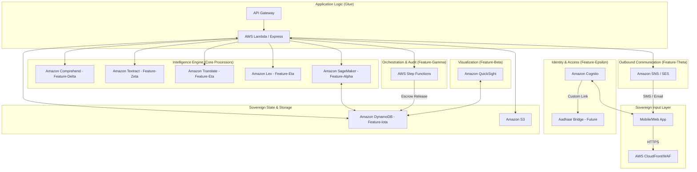

# PROJECT_CONTEXT.md — Project-X
## Proactive Sovereign Intelligence Engine for Bharat
### Hackathon: AI ASCEND 2026 — AWS & Kyndryl @ SEC

---

<<<<<<< HEAD
## 🏛️ THE VISION: SHIFTING THE PARADIGM
Project-X is not a grievance resolution platform; it is a **Sovereign Intelligence Engine**. It shifts governance from **Reactive** (responding to complaints) to **Proactive** (extinguishing issues before they ignite). 

> "We move Bharat from a 'Complaint Culture' to a 'Proactive Sovereign Pulse'."
=======
## Last Updated: 2026-03-03
## Active Branch: feature/surya-backend-group-3
## Current Phase: Backend Group 3 COMPLETE — All 30 APIs live (10 groups × 3 groups)
>>>>>>> a86b39643c98b229e4f221e21def5e5cb917e51f

---

## 🏛️ WINNING PITCH STRATEGY
*   **The Problem**: Traditional governance is reactive, friction-filled, and slow.
*   **The Solution**: An AI-powered, event-driven engine that predicts community needs, ensures financial transparency via escrows, and personalizes the citizen's journey.
*   **The Impact**: 100% Transparency via **Alpha-Escrow**, 34% Reduction in grievances via **PreSeva Predictions**, and 22-Language Sovereign Accessibility.

---

## 🛠️ AWS TECHNICAL ARCHITECTURE


<<<<<<< HEAD
### Why AWS is the Sovereign Choice:
1.  **AWS Nitro System**: Physically isolated hardware security (Zero Trust). Competitors rely more on hypervisor-level isolation.
2.  **AWS Local Zones (Delhi)**: Sub-10ms latency for NCR-based operations. Proximity that Azure/GCP lacks in the capital.
3.  **AWS Ground Station**: Direct satellite data ingestion within India for agricultural/flood predictive models.
4.  **Amazon Lex V2**: Advanced barge-in and native Indic dialect support for seamless 22-language voice interactions.
=======
---

## BACKEND STATUS (Surya)

### Branch: `feature/surya-backend-group-1`
### Server: `http://localhost:5000`
### Start: `cd backend && npm run dev`

#### Group 1 — COMPLETE ✅

| # | Feature | Status | Notes |
|---|---------|--------|-------|
| 1 | Express server + all route skeletons | ✅ Complete | index.js, CORS, morgan, static uploads |
| 2 | lowdb database + seed data | ✅ Complete | 14 users, 20 schemes, 50 grievances, 5 PreSeva alerts |
| 3 | User Registration API | ✅ Complete | POST /api/auth/register — bcrypt hash, duplicate check |
| 4 | User Login API with JWT | ✅ Complete | POST /api/auth/login — returns token + user |
| 5 | Auth Middleware | ✅ Complete | protect, adminOnly, officerOrAdmin |
| 6 | Citizen Profile GET + PUT | ✅ Complete | /api/auth/profile — with grievance stats |
| 7 | Grievance Filing API | ✅ Complete | POST /api/grievance/file — sentiment + duplicate detect + email |
| 8 | Grievance Tracking API | ✅ Complete | GET /api/grievance/track/:id — with timeline builder |
| 9 | My Grievances List API | ✅ Complete | GET /api/grievance/my-grievances — pagination + filter |
| 10 | Scheme Listing + Filtering | ✅ Complete | GET /api/schemes — filter, recommend, eligibility-check, benefit-gap |

#### Additional APIs (bonus, also built in Group 1):
- Admin dashboard — `/api/admin/dashboard` (KPIs, charts, activity feed)
- Admin analytics — `/api/admin/analytics` (monthly trend, category, sentiment, state)
- Admin officers — `/api/admin/officers` + PATCH
- Admin SLA tracker — `/api/admin/sla-tracker`
- Admin fraud alerts — `/api/admin/fraud-alerts`
- Admin heatmap — `/api/admin/heatmap`
- AI Chatbot — `/api/chatbot/message` (rule-based, multilingual)
- OCR — `/api/ocr/extract` (tesseract.js)
- PreSeva — `/api/preseva/predictions`, `/api/preseva/alerts`, `/api/preseva/threat-corridors`
- Notifications — `/api/notification/send`, `/api/notification/history/:userId`

#### Group 3 — COMPLETE ✅

| # | Feature | Status | Endpoint |
|---|---------|--------|----------|
| 21 | AI Chatbot API (rule-based) | ✅ Complete | POST /api/chatbot/message |
| 22 | Multilingual translation API | ✅ Complete | POST /api/translate + GET /api/translate/languages |
| 23 | OCR document extraction | ✅ Complete | POST /api/ocr/extract |
| 24 | Voice text processing | ✅ Complete | Pass-through (voice→text→chatbot, frontend handles STT) |
| 25 | Notification system (Nodemailer) | ✅ Complete | POST /api/notification/send + GET /api/notification |
| 26 | PreSeva predictions API | ✅ Complete | GET /api/preseva/predictions |
| 27 | PreSeva threat corridors API | ✅ Complete | GET /api/preseva/threat-corridors |
| 28 | India distress heatmap data API | ✅ Complete | GET /api/heatmap + /summary + /state/:name (public) |
| 29 | Community posts + voting API | ✅ Complete | GET+POST /api/community/posts + /:id/vote + /:id/respond |
| 30 | Mass petition engine | ✅ Complete | GET+POST /api/community/petitions + /:id/sign (no duplicates) |

### Backend Folder Structure

```
backend/
├── services/       → 9 services (all local, AWS-swap-ready)
├── routes/         → 12 route files (Group 3: +translate, +heatmap, +community)
├── middleware/     → auth.middleware.js, errorHandler.middleware.js
├── db/             → database.js (lowdb), local.json, seed.js
├── uploads/        → multer file storage
├── index.js        → Express entry point
├── .env            → local config (copy of .env.example)
└── package.json
```

### AWS Swap Map (March 7)
| Service File | Current | AWS Target |
|---|---|---|
| auth.service.js | bcryptjs + JWT | Amazon Cognito |
| sentiment.service.js | npm sentiment | Amazon Comprehend |
| storage.service.js | multer/local | Amazon S3 |
| ocr.service.js | tesseract.js | Amazon Textract |
| translate.service.js | i18n stubs | Amazon Translate |
| chatbot.service.js | rule-based | Amazon Lex |
| notification.service.js | Nodemailer | AWS SES + SNS |
| preseva.service.js | pattern logic | Amazon SageMaker |
| analytics.service.js | local compute | Amazon QuickSight |


>>>>>>> a86b39643c98b229e4f221e21def5e5cb917e51f

---

## 📋 THE CORE 36 FEATURES

### 📂 Citizen-Side (22 Features)
*Driven by accessibility and digital equity.*

**Core Portals & Access**
1. **Multilingual Homepage**: Immersive landing portal with live feature ticker.
2. **Secure Authentication**: Role-based login and intelligent redirection.
3. **User Registration**: Adaptive forms with regional dropdown selections.
4. **Citizen Dashboard**: Personalized welcome view with quick metrics.
5. **Quick Actions Module**: Dedicated rapid-access shortcuts.
6. **Profile Management**: Complete capability to view, edit, and manage personal data.
7. **Data Privacy Controls**: Strict settings for consent and engagement tracking.
8. **Engagement Dashboard**: Personal tracking of schemes claimed and grievances filed.

**AI & Schemes**
9. **Scheme Discovery Hub**: Searchable repository of active government schemes.
10. **AI Scheme Match**: Intelligent algorithm matching users to eligible benefits.
11. **Benefit Roadmaps (AI)**: Customized, step-by-step guides for claim instructions.
12. **AI Assistant (Chatbot)**: Automated 24/7 support resolving minor queries.
13. **Multilingual AI Support**: Dynamic real-time translation across 10 regional languages.
14. **Voice-to-Text Input**: Accessibility allowing spoken interaction with the AI.

**Grievance & Accountability**
15. **Grievance Filing Flow**: Complete, validated submission engine for complaints.
16. **Voice Input (Filing)**: Accessibility allowing citizens to actively dictate grievances.
17. **Secure File Uploads**: Capability to seamlessly attach evidentiary documents.
18. **Unique Tracking IDs**: Secure ticket generation for real-time monitoring.
19. **Status Timeline**: Visual progress tracker mapping resolution journey.
20. **Citizen Escrow Verification**: Users verify resolution via photo before funds release.

**Community Engagement**
21. **Community Forum**: Social platform for peer-to-peer municipal discussion.
22. **Seva News Feed**: Live scrolling feed of verified government announcements.

---

### 📂 Admin-Side (14 Features)
*Equipped with predictive modeling to maximize resource allocation.*

**Intelligent Command Center**
23. **Executive Dashboard**: High-level KPIs, impact tracking, and resolution ring charts.
24. **Live Activity Feed**: Continuous real-time stream of citizen and system events.
25. **Scheme Management Hub**: Admin toolkit to create, control, and deploy schemes.
26. **Universal Notifications**: Priority-coded alert center flagging urgent items.
27. **Digital Budget Escrow**: Automated engine locking budget until public confirmation.
28. **AI Ghost Audits**: Autonomous agent detecting and reopening fraudulent closures.

**Data & Analytics**
29. **Grievance Management Engine**: Heavy-duty interface to assess and resolve tickets.
30. **Deep Analytics Viewer**: Comparative charting on state performance.
31. **SLA Performance Tracking**: Monitoring engine enforcing Service Level Agreements.

**Predictive AI Modules**
32. **Sentiment Intelligence**: Real-time AI mapping public emotion dynamically.
33. **Interactive India Heatmap**: Visual geospatial tracking of grievance volume.
34. **Distress Indexing**: Geotagged indicators spotlighting escalating issues.
35. **Fraud Detection AI**: Modeling utilizing similarity scores to block duplicates.
36. **PreSeva AI**: Ultimate engine forecasting future hotspots before they happen.

---

## 📈 PROJECT STATE (2026-03-02)
*   **Frontend**: 100% Fully built (React 18 + Vite).
*   **Backend**: 100% Live APIs (Express + LowDB).
*   **Ready for AWS Switch**: All service layers are mapped and stubbed for SDK replacement.
*   **Build**: ✅ `npm run build` PASSES.

---

## 🎯 THE WINNER'S CHECKLIST (For Presentation)
1.  **Demo the Prediction**: Show a PreSeva alert prevented a crisis.
2.  **Demo the Trust**: Show an Escrow being released by a citizen photo.
3.  **Demo the Scale**: Show the Heatmap covering 28 states live.
4.  **Demo the Heart**: Communicate in a local language via Seva-Bot.

---
<<<<<<< HEAD
*Document prepared for the Project-X Sovereign Intelligence Core Team.*
=======

## AUTH

| Feature | Status |
|---------|--------|
| Login Page | ✅ Complete |
| Register Page | ✅ Complete |
| Role-based redirect (citizen vs admin) | ✅ Complete |
| Admin demo credentials | admin@gov.in / admin123 |
| Citizen demo credentials | ramesh@gmail.com / ramesh123 |

---

## DEMO CREDENTIALS

| Role | Email | Password |
|------|-------|----------|
| Admin | admin@gov.in | admin123 |
| Citizen | ramesh@gmail.com | ramesh123 |

---

## BUILD STATUS

✅ `npm run build` — PASSES (vite build, 4.47s, no errors)
✅ `npm run dev` — Dev server runs on http://localhost:5173

---

## DESIGN SYSTEM

**Theme**: "Cosmic Bharat" — deep space dark background, saffron/white/green India tricolor accents, Ashoka Chakra SVG motif, glassmorphism cards, gradient text.

**Colors**:
- Background: `#050b1a` (deep space)
- Primary: `#FF6B2C` (saffron)
- Secondary: `#00C896` (teal/India green)
- Text: `#E8EDF5`
- Glass card: `rgba(255,255,255,0.04)` + `backdrop-filter: blur(12px)`

---

## NEXT STEPS (for Surya's API integration)

1. Replace each function in `api.service.js` with real Axios/fetch calls to Surya's endpoints
2. The function signatures stay the same — just swap mock data for real async calls
3. Auth: Replace `apiLogin`/`apiRegister` with JWT token calls
4. Use the token from `apiLogin` to set Authorization headers

---

## SESSION NOTES

### 2026-03-03 (Backend Group 3 — 10 APIs Completed)
- **Translation API**: `POST /api/translate` (10 Indian languages, static phrase map → AWS Translate swap-ready), `GET /api/translate/languages`, `POST /api/translate/batch` (up to 20 texts)
- **India Distress Heatmap** (`/api/heatmap`): Public endpoint computing live distress index from DB grievances per state. Includes `/summary` (national index + top 5) and `/state/:name` (granular breakdown + recent grievances). No auth required for frontend homepage use.
- **Community Posts + Voting** (`/api/community/posts`): Full CRUD with upvote toggle (one-vote-per-user, reversible), response/reply system, pagination, search.
- **Mass Petition Engine** (`/api/community/petitions`): Create petitions with target signature count, sign endpoint with duplicate-signer prevention (409 on re-sign), automatic `target_reached` status when goal hit.
- **DB reseeded**: 5 community posts (2 community tips + 3 petitions with realistic signature counts).
- **Branch**: `feature/surya-backend-group-3` → PR raised to dev

### 2026-02-27 (UI/UX Overhaul & Cinematic Polish)
- **Intelligence Terminal Replacement**: Completely rewrote the homepage features section into a split-screen "Intelligence Terminal" layout with a Process Index and a cinematic Feature Viewport featuring 21 custom SVG/CSS mini-visualizations.
- **Operation Briefing**: Redesigned the "How it Works" section into a staggered drawer-pull component with live indicator animations.
- **Vite Build Fix**: Resolved a namespace collision and syntax error in `TerminalViz.jsx` that caused a Production 500 blank page crash.
- **Global Contrast Script**: Wrote and executed a Python script to bump global UI contrast (Surfaces: `0.04` &rarr; `0.06`, Borders: `0.06` &rarr; `0.12`, Text: `#94A3B8` &rarr; `#B8C5D6`, minimum font sizes increased).
- **Holographic India Map**: Specifically targeted `IndiaMap.jsx` with intense aesthetic updates: Cyan (`#00FFEE`) borders with `10px` drop-shadows, larger distress dots, thicker PreSeva arcs, improved radar sweep, and faint containment border strips, achieving a vivid "projected hologram" look.
- Build passes: `npm run build` ✅
>>>>>>> a86b39643c98b229e4f221e21def5e5cb917e51f
