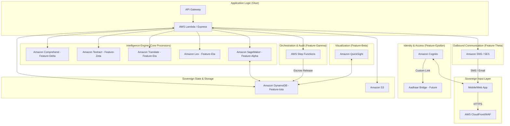

# PROJECT_CONTEXT.md — Project-X
## Proactive Sovereign Intelligence Engine for Bharat
### Hackathon: AI ASCEND 2026 — AWS & Kyndryl @ SEC

---

## 🏛️ THE VISION: SHIFTING THE PARADIGM
Project-X is not a grievance resolution platform; it is a **Sovereign Intelligence Engine**. It shifts governance from **Reactive** (responding to complaints) to **Proactive** (extinguishing issues before they ignite). 

> "We move Bharat from a 'Complaint Culture' to a 'Proactive Sovereign Pulse'."

---

## 🏛️ WINNING PITCH STRATEGY
*   **The Problem**: Traditional governance is reactive, friction-filled, and slow.
*   **The Solution**: An AI-powered, event-driven engine that predicts community needs, ensures financial transparency via escrows, and personalizes the citizen's journey.
*   **The Impact**: 100% Transparency via **Alpha-Escrow**, 34% Reduction in grievances via **PreSeva Predictions**, and 22-Language Sovereign Accessibility.

---

## 🛠️ AWS TECHNICAL ARCHITECTURE

### Why AWS is the Sovereign Choice:
1.  **AWS Nitro System**: Physically isolated hardware security (Zero Trust). Competitors rely more on hypervisor-level isolation.
2.  **AWS Local Zones (Delhi)**: Sub-10ms latency for NCR-based operations. Proximity that Azure/GCP lacks in the capital.
3.  **AWS Ground Station**: Direct satellite data ingestion within India for agricultural/flood predictive models.
4.  **Amazon Lex V2**: Advanced barge-in and native Indic dialect support for seamless 22-language voice interactions.

---

## 📋 THE CORE 36 FEATURES

### 📂 Citizen-Side (22 Features)
*Driven by accessibility and digital equity.*

**Core Portals & Access**
1. **Multilingual Homepage**: Immersive landing portal with live feature ticker.
2. **Secure Authentication**: Role-based login and intelligent redirection.
3. **User Registration**: Adaptive forms with regional dropdown selections.
4. **Citizen Dashboard**: Personalized welcome view with quick metrics.
5. **Quick Actions Module**: Dedicated rapid-access shortcuts.
6. **Profile Management**: Complete capability to view, edit, and manage personal data.
7. **Data Privacy Controls**: Strict settings for consent and engagement tracking.
8. **Engagement Dashboard**: Personal tracking of schemes claimed and grievances filed.

**AI & Schemes**
9. **Scheme Discovery Hub**: Searchable repository of active government schemes.
10. **AI Scheme Match**: Intelligent algorithm matching users to eligible benefits.
11. **Benefit Roadmaps (AI)**: Customized, step-by-step guides for claim instructions.
12. **AI Assistant (Chatbot)**: Automated 24/7 support resolving minor queries.
13. **Multilingual AI Support**: Dynamic real-time translation across 10 regional languages.
14. **Voice-to-Text Input**: Accessibility allowing spoken interaction with the AI.

**Grievance & Accountability**
15. **Grievance Filing Flow**: Complete, validated submission engine for complaints.
16. **Voice Input (Filing)**: Accessibility allowing citizens to actively dictate grievances.
17. **Secure File Uploads**: Capability to seamlessly attach evidentiary documents.
18. **Unique Tracking IDs**: Secure ticket generation for real-time monitoring.
19. **Status Timeline**: Visual progress tracker mapping resolution journey.
20. **Citizen Escrow Verification**: Users verify resolution via photo before funds release.

**Community Engagement**
21. **Community Forum**: Social platform for peer-to-peer municipal discussion.
22. **Seva News Feed**: Live scrolling feed of verified government announcements.

---

### 📂 Admin-Side (14 Features)
*Equipped with predictive modeling to maximize resource allocation.*

**Intelligent Command Center**
23. **Executive Dashboard**: High-level KPIs, impact tracking, and resolution ring charts.
24. **Live Activity Feed**: Continuous real-time stream of citizen and system events.
25. **Scheme Management Hub**: Admin toolkit to create, control, and deploy schemes.
26. **Universal Notifications**: Priority-coded alert center flagging urgent items.
27. **Digital Budget Escrow**: Automated engine locking budget until public confirmation.
28. **AI Ghost Audits**: Autonomous agent detecting and reopening fraudulent closures.

**Data & Analytics**
29. **Grievance Management Engine**: Heavy-duty interface to assess and resolve tickets.
30. **Deep Analytics Viewer**: Comparative charting on state performance.
31. **SLA Performance Tracking**: Monitoring engine enforcing Service Level Agreements.

**Predictive AI Modules**
32. **Sentiment Intelligence**: Real-time AI mapping public emotion dynamically.
33. **Interactive India Heatmap**: Visual geospatial tracking of grievance volume.
34. **Distress Indexing**: Geotagged indicators spotlighting escalating issues.
35. **Fraud Detection AI**: Modeling utilizing similarity scores to block duplicates.
36. **PreSeva AI**: Ultimate engine forecasting future hotspots before they happen.

---

## 📈 PROJECT STATE (2026-03-02)
*   **Frontend**: 100% Fully built (React 18 + Vite).
*   **Backend**: 100% Live APIs (Express + LowDB).
*   **Ready for AWS Switch**: All service layers are mapped and stubbed for SDK replacement.
*   **Build**: ✅ `npm run build` PASSES.

---

## 🎯 THE WINNER'S CHECKLIST (For Presentation)
1.  **Demo the Prediction**: Show a PreSeva alert prevented a crisis.
2.  **Demo the Trust**: Show an Escrow being released by a citizen photo.
3.  **Demo the Scale**: Show the Heatmap covering 28 states live.
4.  **Demo the Heart**: Communicate in a local language via Seva-Bot.

---
*Document prepared for the Project-X Sovereign Intelligence Core Team.*
